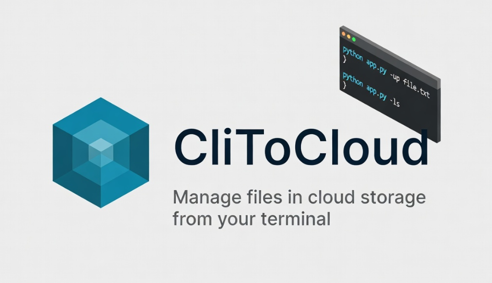

# CliToCloud

CliToCloud is a Python command-line app for managing files in cloud storage. It can create and delete buckets, upload files, delete files, download files, and list files from the cloud.

## Features

- Create a cloud storage bucket
- Delete a cloud storage bucket
- Upload files
- Delete files
- Download files
- List cloud files

## Requirements

- Python 3.x
- Appwrite project credentials
- Python packages from `requirements.txt`

## Setup

1. Open the project folder:

```powershell
cd C:\Users\CliToCloud
```

2. Create and activate a virtual environment:

```powershell
python -m venv .venv
.\.venv\Scripts\activate
```

3. Install dependencies:

```powershell
pip install -r requirements.txt
```

4. Create a `.env` file in the project root.

5. Add your cloud credentials:

```env
API_ENDPOINT=
PROJECT_ID=
API_KEY=
```

## Usage

Show help:

```powershell
python app.py --help
```

Create a bucket:

```powershell
python app.py -newb
```

Upload a file:

```powershell
python app.py -up <filename-or-path>
```

List files:

```powershell
python app.py -ls <path>
```

Download a file:

```powershell
python app.py -dwl <filename>
```

Delete a file:

```powershell
python app.py -del <filename>
```

Delete the bucket:

```powershell
python app.py -delb
```
